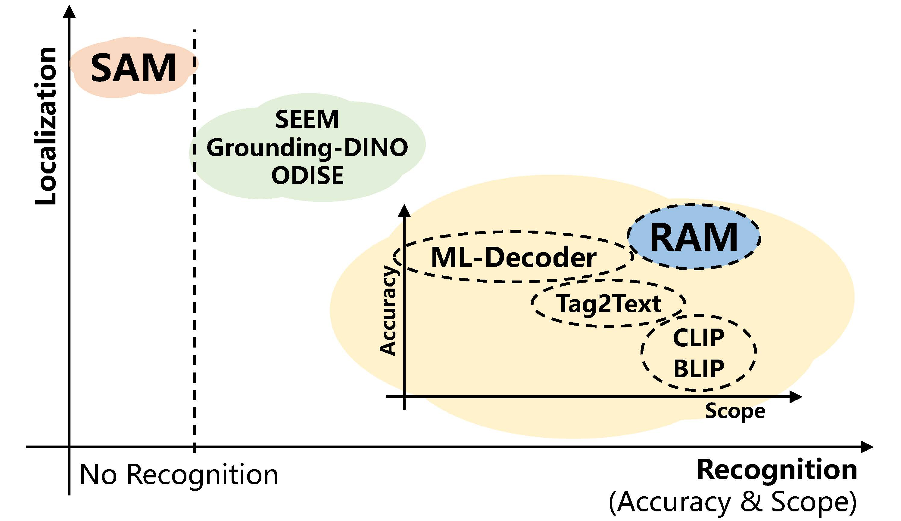
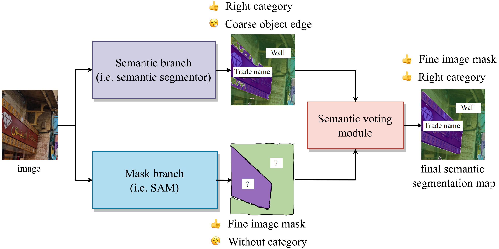
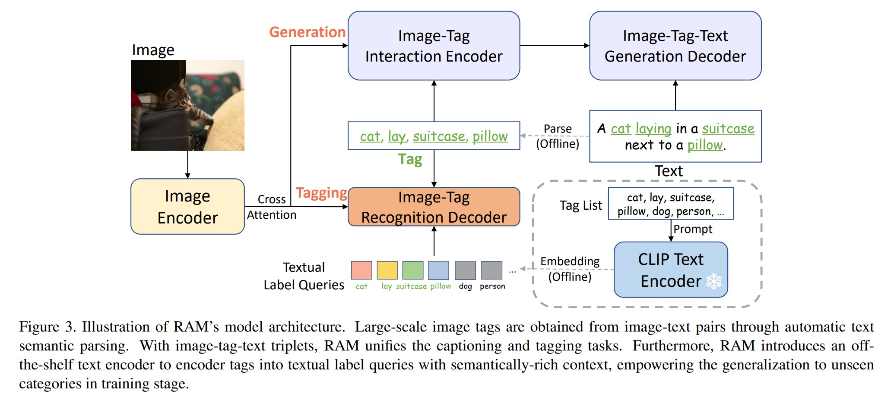
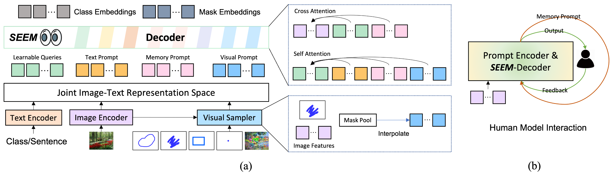

# 
Awesome Foundation Model
  

  

## Vision Large Model

SAM: Segment Anything Model

    

We introduce the Segment Anything (SA) project: a new task, model, and dataset for image segmentation. Using our efficient model in a data collection loop, we built the largest segmentation dataset to date (by far), with over 1 billion masks on 11M licensed and privacy respecting images. The model is designed and trained to be promptable, so it can transfer zero-shot to new image distributions and tasks. We evaluate its capabilities on numerous tasks and find that its zero-shot performance is impressive – often competitive with or even superior to prior fully supervised results. We are releasing the Segment Anything Model (SAM) and corresponding dataset (SA-1B) of 1B masks and 11M images at https://segment-anything.com to foster research into foundation models for computer vision.
 
paper: https://arxiv.org/pdf/2304.02643.pdf  
code: https://segment-anything.com  
project: https://segment-anything.com  
demo: https://segment-anything.com/demo  

SSA: Semantic segment anything

    

SAM is a powerful model for arbitrary object segmentation, while SA-1B is the largest segmentation dataset to date. However, SAM lacks the ability to predict semantic categories for each mask. (I) To address above limitation, we propose a pipeline on top of SAM to predict semantic category for each mask, called Semantic Segment Anything (SSA). (II) Moreover, our SSA can serve as an automated dense open-vocabulary annotation engine called Semantic segment anything labeling engine (SSA-engine), providing rich semantic category annotations for SA-1B or any other dataset. This engine significantly reduces the need for manual annotation and associated costs.

paper:  
code: https://github.com/fudan-zvg/Semantic-Segment-Anything  
demo: https://replicate.com/cjwbw/semantic-segment-anything

RAM: Recognize Anything - A Strong Image Tagging Model

    

We present the Recognize Anything Model (RAM): a strong foundation model for image tagging. RAM makes a substantial step for large models in computer vision, demonstrating the zero-shot ability to recognize any common category with high accuracy. RAM introduces a new paradigm for image tagging, leveraging large-scale imagetext pairs for training instead of manual annotations. The development of RAM comprises four key steps. Firstly, annotation-free image tags are obtained at scale through automatic text semantic parsing. Subsequently, a preliminary model is trained for automatic annotation by unifying the caption and tagging tasks, supervised by the original texts and parsed tags, respectively. Thirdly, a data engine is employed to generate additional annotations and clean incorrect ones. Lastly, the model is retrained with the processed data and fine-tuned using a smaller but higherquality dataset. We evaluate the tagging capabilities of RAM on numerous benchmarks and observe impressive zero-shot performance, significantly outperforming CLIP and BLIP. Remarkably, RAM even surpasses the fully supervised manners and exhibits competitive performance with the Google tagging API. We are releasing the RAM at https://recognize-anything.github.io/ to foster the advancements of large models in computer vision.

paper: https://arxiv.org/pdf/2306.03514.pdf  
code: https://github.com/xinyu1205/Recognize_Anything-Tag2Text  
demo: https://huggingface.co/spaces/xinyu1205/Recognize_Anything-Tag2Text  
project: https://recognize-anything.github.io/  

SEEM: Segment Everything Everywhere All at Once

    

Despite the growing demand for interactive AI systems, there have been few comprehensive studies on human-AI interaction in visual understanding e.g. segmentation. Inspired by the development of prompt-based universal interfaces for LLMs, this paper presents SEEM, a promptable, interactive model for Segmenting Everything Everywhere all at once in an image. SEEM has four desiderata: i) Versatility by introducing a versatile prompting engine for different types of prompts, including points, boxes, scribbles, masks, texts, and referred regions of another image; ii) Compositionality by learning a joint visual-semantic space for visual and textual prompts to compose queries on the fly for inference as shown in Fig. 1; iii) Interactivity by incorporating learnable memory prompts to retain dialog history information via mask-guided cross-attention; and iv) Semantic-awareness by using a text encoder to encode text queries and mask labels for open-vocabulary segmentation. A comprehensive empirical study is performed to validate the effectiveness of SEEM on various segmentation tasks. SEEM shows a strong capability of generalizing to unseen user intents as it learned to compose prompts of different types in a unified representation space. In addition, SEEM can efficiently handle multiple rounds of interactions with a lightweight prompt decoder. The SEEM demo is available at https://github.com/UX-Decoder/Segment-Everything-Everywhere-All-At-Once, and the source code will be released at the same place.

paper: https://arxiv.org/pdf/2304.06718.pdf  
code: https://github.com/UX-Decoder/Segment-Everything-Everywhere-All-At-Once  
demo: https://huggingface.co/spaces/xdecoder/SEEM   

##  Self-Supervised Pretraining for Vision Large Model

##  Vision Large Model for Downstream Task

InternImage: Exploring Large-Scale Vision Foundation Models with Deformable Convolutions

    

Compared to the great progress of large-scale vision transformers (ViTs) in recent years, large-scale models based on convolutional neural networks (CNNs) are still
in an early state. This work presents a new large-scale CNN-based foundation model, termed InternImage, which can obtain the gain from increasing parameters and training data like ViTs. Different from the recent CNNs that focus on large dense kernels, InternImage takes deformable convolution as the core operator, so that our model not only has the large effective receptive field required for downstream tasks such as detection and segmentation, but also has the adaptive spatial aggregation conditioned by input and task information. As a result, the proposed InternImage reduces the strict inductive bias of traditional CNNs and makes it possible to learn stronger and more robust patterns with large-scale parameters from massive data like ViTs. The effectiveness of our model is proven on challenging benchmarks including ImageNet, COCO, and ADE20K. It is worth mentioning that InternImage-H achieved a new record 65.4 mAP on COCO test-dev and 62.9 mIoU on ADE20K, outperforming current leading CNNs and ViTs.
 
paper: https://arxiv.org/pdf/2304.02643.pdf  
code: https://github.com/OpenGVLab/InternImage  

